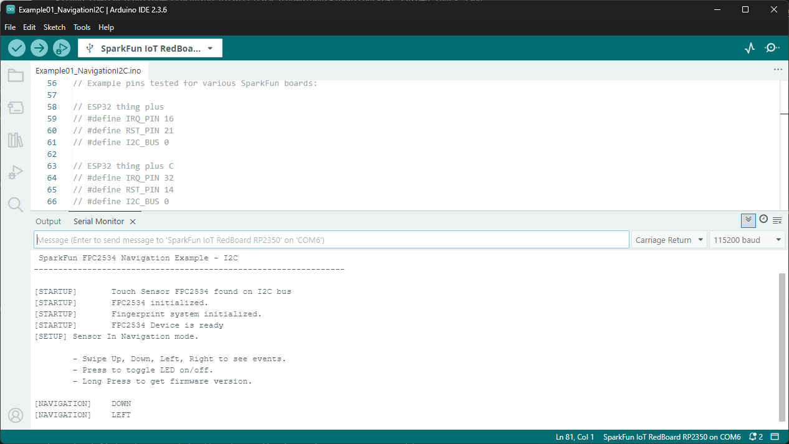
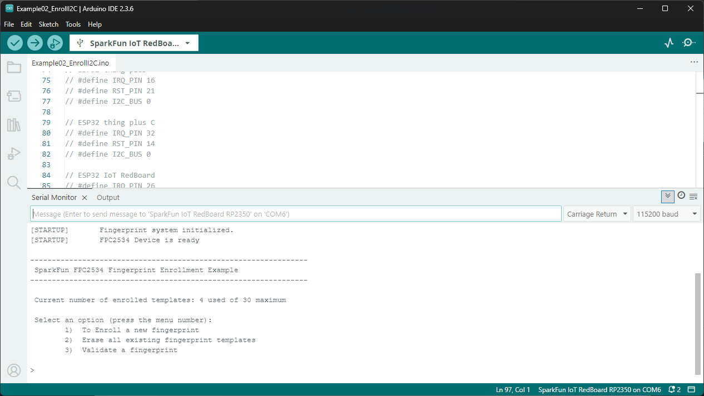
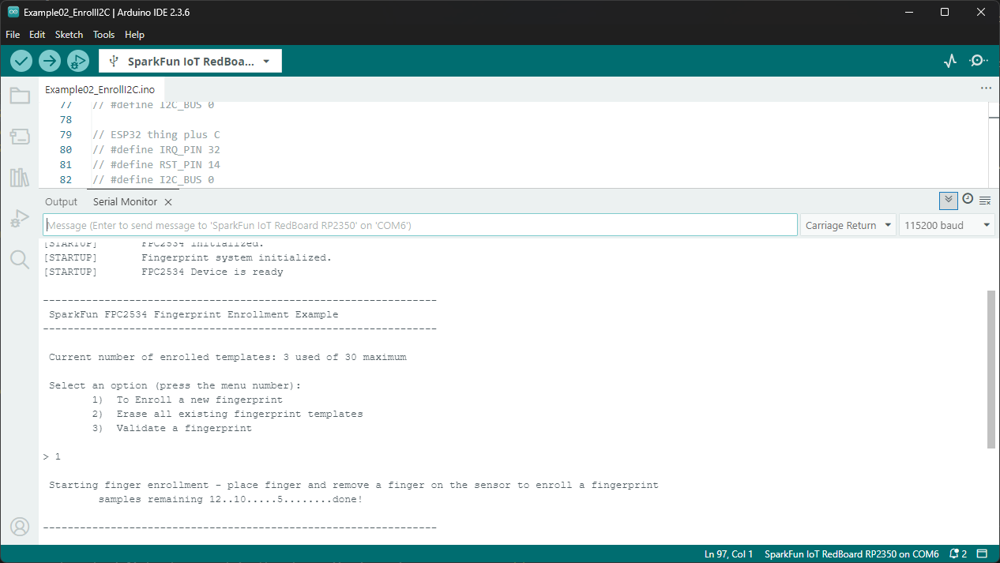
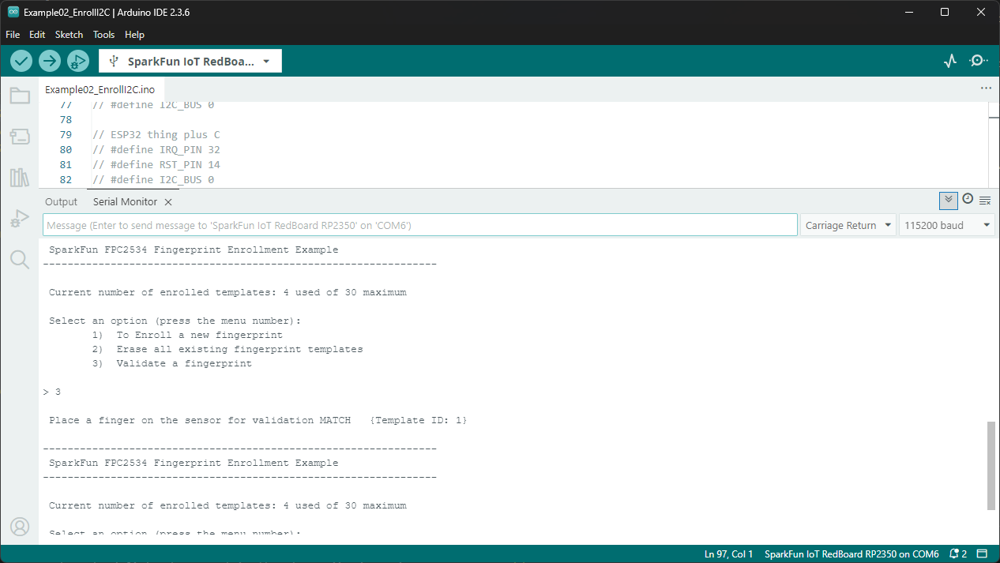

The SparkFun FPC2534 Arduino Library contains four examples that demonstrate how to use the fingerprint sensor over either I<sup>2</sup>C, UART or SPI. Reminder, communicating with the Fingerprint Sensor over USB is <i>not</i> supported by this library. Each pair of examples (I2C, UART, SPI) perform the same actions just over the different interface options so we'll just be covering the first two for I<sup>2</sup>C.

!!! arduino
    If you're following along and using the RedBoard IoT - RP2350, make sure you've installed the "arduino-pico" boards package before uploading the code. If you need help installing the boards package, you can find detailed instructions for it [here](https://docs.sparkfun.com/SparkFun_IoT_RedBoard-RP2350/arduino/#arduino-pico-boards).

## Example 01 - Navigation I<sup>2</sup>C

The first example shows how to use the FPC2534's navigation tools to register movement on the sensing area. This navigation recognizes swiping Up, Down, Left and Right and also a press and hold to turn the green SCAN LED on and off. Open the example by navigating to **File** > **Examples** > **SparkFun FPC2534 Arduino Library** > **Example01_NavigationI2C**. 

The example defaults to work with a RedBoard IoT - ESP32 so if you're using a different board like the RedBoard IoT - RP2350 we used in the Hardware Assembly section, you'll need to adjust the pin definitions to switch to the correct board. For example, to switch to using the RedBoard IoT - RP2350, comment out the defines for the ESP32 like this:

``` c++
// ESP32 IoT RedBoard
// #define IRQ_PIN 26
// #define RST_PIN 27
// #define I2C_BUS 0
```

And then uncomment the defines for the RedBoard IoT - RP2350:

``` c++
// rp2350 RedBoard IoT
#define IRQ_PIN 29
#define RST_PIN 28
#define I2C_BUS 0
```

After editing the example, select your Board and Port and click the "Upload" button. Once the code finishes compiling and uploading, open the [serial monitor](https://docs.arduino.cc/software/ide-v2/tutorials/ide-v2-serial-monitor) with the baud set to **115200** and you should see the following print out:

<figure markdown>
[{ width="1000"}](./assets/img/NAV_I2C_Example.png "Click to enlarge")
</figure>

Try swiping your finger over the sensing area in different directions and you should see a print out to the corresponding direction (Up, Down, Left or Right). You can also press your finger down on the sensor to turn the scan LED on and off or press and hold it to print out the sensor's firmware version.

## Example 02 - Enrollment I<sup>2</sup>C

The second example shows how to create, verify and erase fingerprint templates on the FPC2534. Open the example by navigating to **File** > **Examples** > **SparkFun FPC2534 Arduino Library** > **Example02_EnrollI2C**. 

Just like the previous example, this defaults to work with the RedBoard IoT - ESP32 so you'll need to adjust the pin definitions like we did above if you're using a different board like the RedBoard IoT - RPS2350. Copy the adjustments from Example 01 if needed. 

After editing the example, select your Board and Port and click the "Upload" button. Once the code finishes compiling and uploading, open the serial monitor with the baud set to **115200** and you should see the following menu print out:

<figure markdown>
[{ width="1000"}](./assets/img/Enroll_I2C_Example-Menu.png "Click to enlarge")
</figure>

This menu gives you three options: enroll a new fingerprint template, erase all stored templates and verify a template. Enter "1" into the serial monitor to enroll a new fingerprint. Once you see the prompt for creating a new template, place and remove a finger on the sensor taking care to cover the entire sensing area. You'll need to repeat this step 12 times and it's recommended to place your finger at different orientations while still covering the entire sensor to create a reliable template. Once all samples are taken you'll see "done" and the code reverts back to the main menu:

<figure markdown>
[{ width="1000"}](./assets/img/Enroll_I2C_Example-Create.png "Click to enlarge")
</figure>

Now that we've created a new template, let's check to make sure we can validate it. Select option 3 "Validate a fingerprint" by entering "3" into the serial monitor input. The code will prompt to place a finger for validation and, if it matches a stored template it prints out "MATCH" along with the Template ID:

<figure markdown>
[{ width="1000"}](./assets/img/Enroll_I2C_Example-Verify.png "Click to enlarge")
</figure>

You've now successfully created and validated a fingerprint template! You can use these stored templates to trigger whatever kind of output you'd like for your next fingerprint sensing project.

## Examples 3 through 6

The rest of the examples are copies of the Navigation and Enroll examples we covered above, just for UART and SPI so we won't be covering them in detail here.

!!! arduino 
    **Note:** The UART examples default to use `Serial1` on a connected development board so make sure to wire the Fingerprint Sensor's UART pins to your development board's Serial1 pins or adjust the code to use [software serial](https://docs.arduino.cc/learn/built-in-libraries/software-serial/) if needed.
