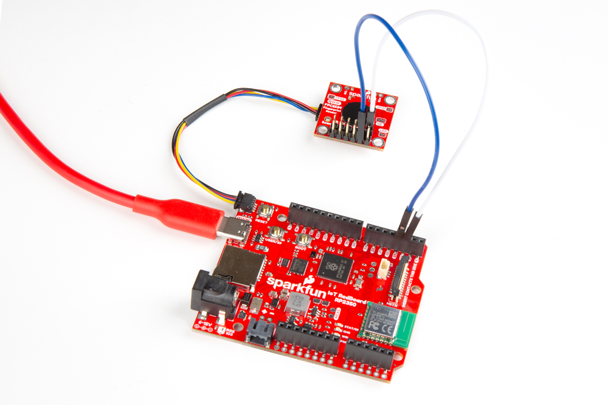
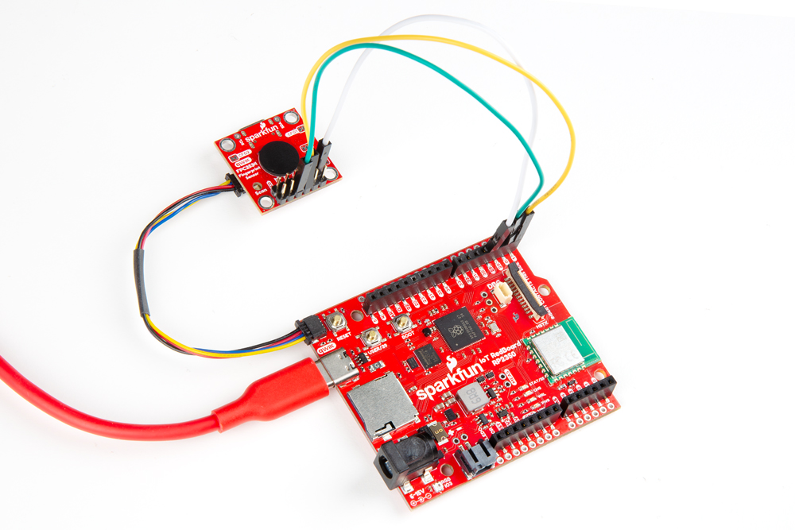

!!! note "Soldering and Solder Jumpers"

This Qwiic breakout is a bit unique as it requires some extra assembly beyond just connecting it to your development board using a Qwiic cable. Using it over I2C requires connecting the FPC2534's Reset and Interrupt Request pins to compatible GPIO pins on your microcontroller. Because of this, we opted to solder a pair of male headers to the PTHs on this breakout for easy prototyping and testing using jumper wires.

Before moving on to the assembly options below, solder either headers or wires to your Qwiic Fingerprint Sensor and then connect using your preferred interface.
## Qwiic Assembly

This Qwiic breakout requires some extra assembly compared to most of our Qwiic boards need as the FPC2534 needs to have its Reset (RST) Interrupt Request (IRQ) pins connected to GPIO pins on a microcontroller to work properly over I2C. 

After soldering, connect the Qwiic Fingerprint Sensor - FPC2534 to the IoT RedBoard - RP2350 using a Qwiic cable then connect the Reset pin to <code>28</code> and the Interrupt Request pin to <code>29</code>. With everything wired up, your circuit should look similar to the photo below:

<figure markdown>
[{ width="800"}](./assets/img/Fingerprint_Sensor_Qwiic-I2C.jpg "Click to enlarge")
</figure>

## UART Assembly

Enable the UART interface by opening the CFG2 jumper. Connect the Qwiic Fingerprint Sensor to the RedBoard IoT - RP2350 following the table below:

<table>
    <tr>
        <th>Fingerprint Sensor</th>
        <th>RedBoard IoT - RP2350</th>
    </tr>
    <tr>
        <td>TX</td>
        <td>1</td>
    </tr>
    <tr>
        <td>RX</td>
        <td>0</td>
    </tr>
    <tr>
        <td>RST</td>
        <td>28</td>
    </tr>
</table>

After wiring everything up, your circuit should look similar to this photo:

<figure markdown>
[{ width="800"}](./assets/img/Fingerprint_Sensor_Qwiic-UART.jpg "Click to enlarge")
</figure>

## SPI Assembly

Finally, if you'd prefer to use the SPI interface, enable SPI by opening both config jumpers (CFG1 and CFG2). Connect the Fingerprint Sensor to the RedBoard IoT - RP2350 by following the table below: 

<table>
    <tr>
        <th>Fingerprint Sensor</th>
        <th>RedBoard IoT - RP2350</th>
    </tr>
    <tr>
        <td>PICO</td>
        <td>POCI</td>
    </tr>
    <tr>
        <td>POCI</td>
        <td>PICO</td>
    </tr>
    <tr>
        <td>SCK</td>
        <td>SCK</td>
    </tr>
    <tr>
        <td>CS</td>
        <td>5/CS</td>
    </tr>
</table>

## USB Assembly (Not supported)

If you'd like to use the Fingerprint Sensor as a USB device, enable the USB interface by opening the CFG1 jumper and then connect it to a USB host device over USB-C.