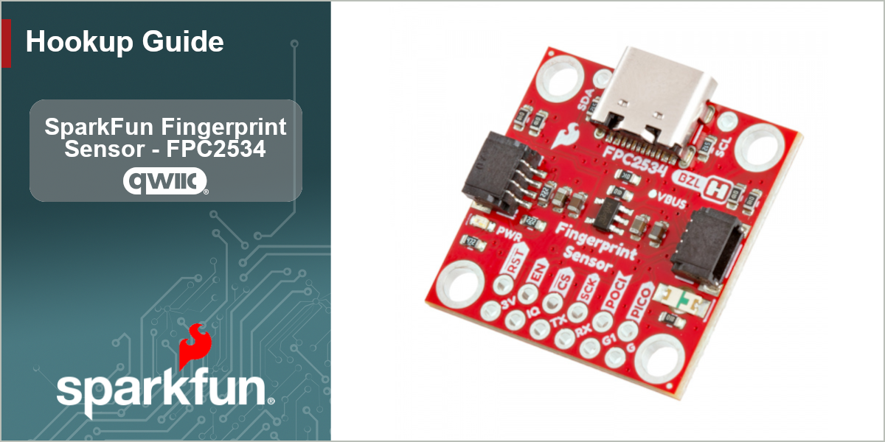

<figure markdown>
[{ width="1000"}](https://www.sparkfun.com/sparkfun-fingerprint-sensor-fpc2534-qwiic.html)
</figure>

The SparkFun FPC2534 Qwiic Fingerprint Sensor is a powerful, dual-purpose breakout that combines professional-grade biometric security with touch navigation. Built around the advanced FPC2354 sensor from Fingerprint Cards AB (FPC), this board handles the complex processing of fingerprint enrollment, encryption, and internal storage, ensuring your data remains secure without bogging down your host microcontroller.

In order to follow along with this tutorial, you'll need the following materials along with the SparkFun Qwiic Fingerprint Sensor - FPC2534.

* [RedBoard IoT - RP2350](https://www.sparkfun.com/catalog/product/view/id/17811/s/sparkfun-iot-redboard-rp2350/) or [RedBoard IoT - ESP32](https://www.sparkfun.com/sparkfun-iot-redboard-esp32-development-board.html)
* [USB-C Cable](https://www.sparkfun.com/usb-a-to-usb-c-cable-1m-usb-2-0-flexible-silicone.html)
* [Qwiic Cable](https://www.sparkfun.com/flexible-qwiic-cable-100mm.html)

Communication with the FPC2534 over I2C requires connecting the Reset and Interrupt Request pins to GPIO pins on a microcontroller or development board. We'll be using male headers and jumper wires to make those connections:

* [Male Headers - Breakaway](https://www.sparkfun.com/header-1x20-male-0-1.html)
* [Jumper Wires](https://www.sparkfun.com/jumper-wires-premium-12-m-m-pack-of-10.html)

You'll also need a soldering iron and solder to use the breakout with a compatible development board. If you need either of those items, we have a selection of them available in our [Soldering category](https://www.sparkfun.com/tools/soldering.html).

## Topics Covered

This document contains three main sections: **Quickstart Guide**, **Hardware** and **Software**. 

The Quickstart Guide assumes a working knowledge of how to assemble and use Qwiic breakouts, perform through-hole soldering and using the Arduino IDE. It covers a quick assembly and then jumps right into getting the necessary software packages installed to start uploading code in just a few short minutes.

The Hardware pages cover a hardware overview that provides a detailed overview of the Qwiic Fingerprint Sensor - FPC2534 covering all the major components on the board in detail as well as a hardware assembly page which goes over the steps required to assemble and use the board with a compatible Arduino development board.

The Software pages give instructions on how to install the SparkFun FPC2534 Arduino Library and use the examples included in it.

## Resources and Documentation

You'll find the board design files (KiCad files & schematic), relevant documentation (datasheets, white papers, etc.) and other helpful links in the **Resources**. Lastly, the **Support** section includes a Troubleshooting page that includes any helpful tips specific to this board as well as information on how to receive technical support from SparkFun.